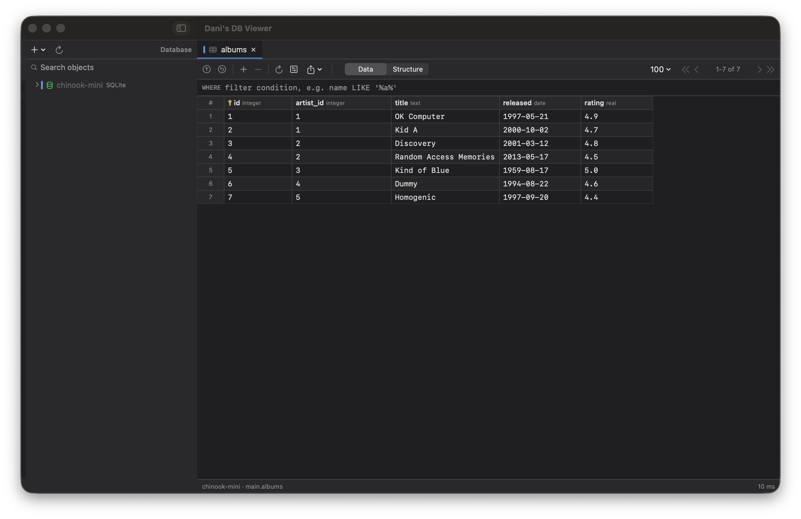
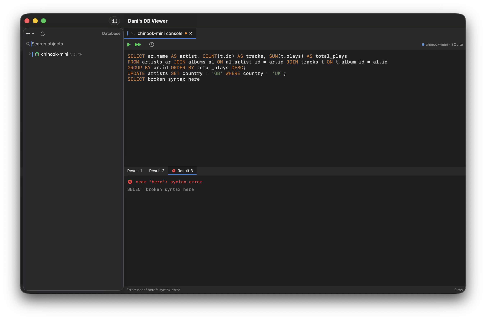

# Dani's DB Viewer

A native macOS clone of IntelliJ IDEA's **Database** tool window, written in
SwiftUI/AppKit. Multiple data sources, schema explorer, editable data grid with
staged changes, and SQL consoles — in a Darcula-flavored UI.





## Supported databases

| DBMS | Driver |
|---|---|
| SQLite | system `libsqlite3` |
| PostgreSQL | [PostgresNIO](https://github.com/vapor/postgres-nio) |
| MySQL / MariaDB | [MySQLNIO](https://github.com/vapor/mysql-nio) |

## Features

- **Data sources**: add / edit / duplicate / remove; Test Connection; per-source
  color labels; passwords in the macOS Keychain; config persisted in
  `~/Library/Application Support/DanisDBViewer/`.
- **Explorer tree**: schemas → tables / views → columns (PK/FK markers, types),
  indexes, foreign keys; speed search; refresh; context menus (open, console,
  DDL, copy name, drop).
- **Table editor**: pagination (10–1000 rows/page), header-click sorting
  (asc → desc → none), raw `WHERE` filter field, inline cell editing,
  add/delete rows — all staged IntelliJ-style and applied in one transaction on
  Submit (⌘⏎), with color-coded pending changes; record (transpose) view;
  value viewer; export CSV / JSON / SQL INSERTs.
- **SQL console**: per-source consoles with syntax highlighting,
  schema-aware completion (Esc/F5 completion via NSTextView), run statement at
  caret / selection / whole script (⌘⏎), one result tab per statement,
  affected-row counts, per-statement errors, execution times, persisted query
  history.
- **DDL viewer** for tables and views.
- **IntelliJ import**: `python3 scripts/import-intellij.py <project>/.idea` pulls
  your existing IntelliJ data sources (hosts, ports, users — passwords stay in
  IntelliJ's keychain; enter them once in the app).

## Security

No credentials ever touch the repo. Passwords live in a plaintext file
**outside the repo** — `~/Library/Application Support/DanisDBViewer/secrets.json`
(`chmod 600`, `{ "<connection-uuid>": "<password>" }`) — the same model as
`~/.pgpass` or a local `.env`. `connections.json` (same dir) holds hosts/users
only. `secrets.json`/`.env` are also gitignored defensively.

(Earlier versions used the macOS Keychain, but its ACL re-prompts every time the
app's code signature changes; run `scripts/keychain-to-file.sh` once to migrate.)

## Build & run

```bash
swift run                    # debug run
./scripts/make-app.sh        # package dist/Dani's DB Viewer.app
swift test                   # unit + (env-gated) integration tests
```

Requires Xcode 16+ / Swift 6 toolchain, macOS 14+.

## Try it with sample data

`SampleData/chinook-mini.db` ships in the repo — add a SQLite data source
pointing at it. For Postgres/MySQL test instances:

```bash
docker run -d --name danis-pg -e POSTGRES_PASSWORD=secret -p 55432:5432 postgres:16-alpine
docker run -d --name danis-mysql -e MYSQL_ROOT_PASSWORD=secret -e MYSQL_DATABASE=shop -p 53306:3306 mysql:8.4
```

## Architecture

```
Sources/DanisDBViewer/
  Model/      DataSourceConfig, DBValue, schema/result types
  Drivers/    DatabaseDriver protocol + SQLite / Postgres / MySQL impls
  SQL/        statement splitter, DDL generator, exporters
  Services/   connection store, live sessions, keychain, query history
  UI/         explorer tree, tabs, data grid, SQL console, dialogs
```

Automation hooks for testing/screenshots: `DANIS_OPEN_TABLE=<name>`,
`DANIS_OPEN_CONSOLE=1`, `DANIS_SQL=<script>`, `DANIS_WINFRAME=x,y,w,h`.
